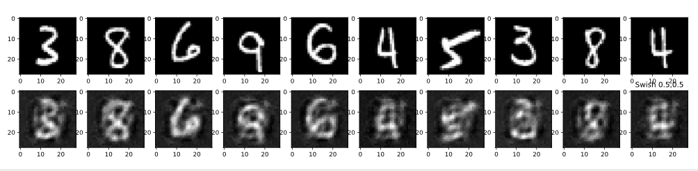

# Tensorflow-Based-Autoencoder
An autoencoder model implemented with Tensorflow library and able to reproduce the input image with different activation functions. The autoencoder is trained with ReLU activation function and testing with arbitrary designed activation function to see how well it reproduce the images. 

## Usage
Training autoencoder model
```python
python3 auto_train.py
```
Testing autoencoder model and design your own activation function in the file to reproduced the images 
```python
python3 auto_testing.py
```
## Example
Following are the results of the autoencoder. The top row of images are original images and the bottom row of images are the reproduced images with a different activation function from the activation function used in training


